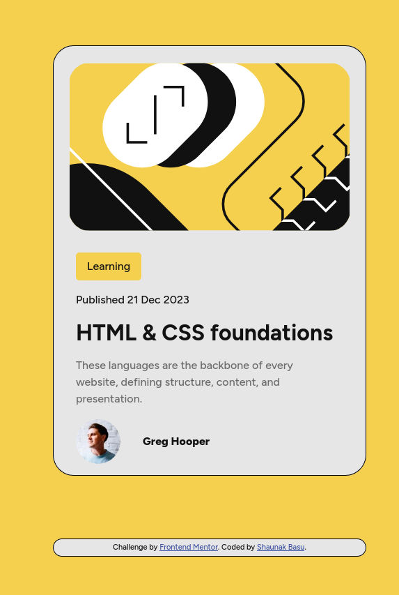

# Frontend Mentor - Blog preview card solution

This is a solution to the [Blog preview card challenge on Frontend Mentor](https://www.frontendmentor.io/challenges/blog-preview-card-ckPaj01IcS). Frontend Mentor challenges help you improve your coding skills by building realistic projects. 

## Overview

### The challenge

Users should be able to:

- See hover and focus states for all interactive elements on the page

### Screenshot

### Links

- Solution URL: (https://github.com/basushaunak/blog-preview-card-FM)
- Live Site URL: (https://basushaunak.github.io/blog-preview-card-FM/)

## My process

### Built with
- CSS custom properties
- Flexbox
- Mobile-first workflow

